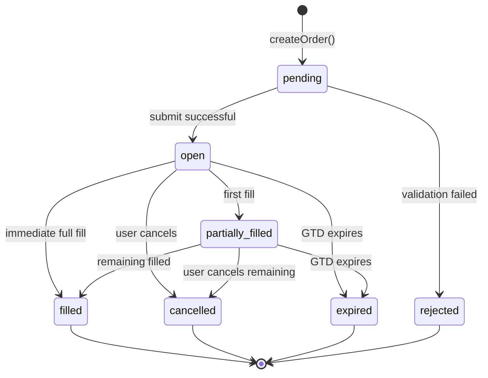
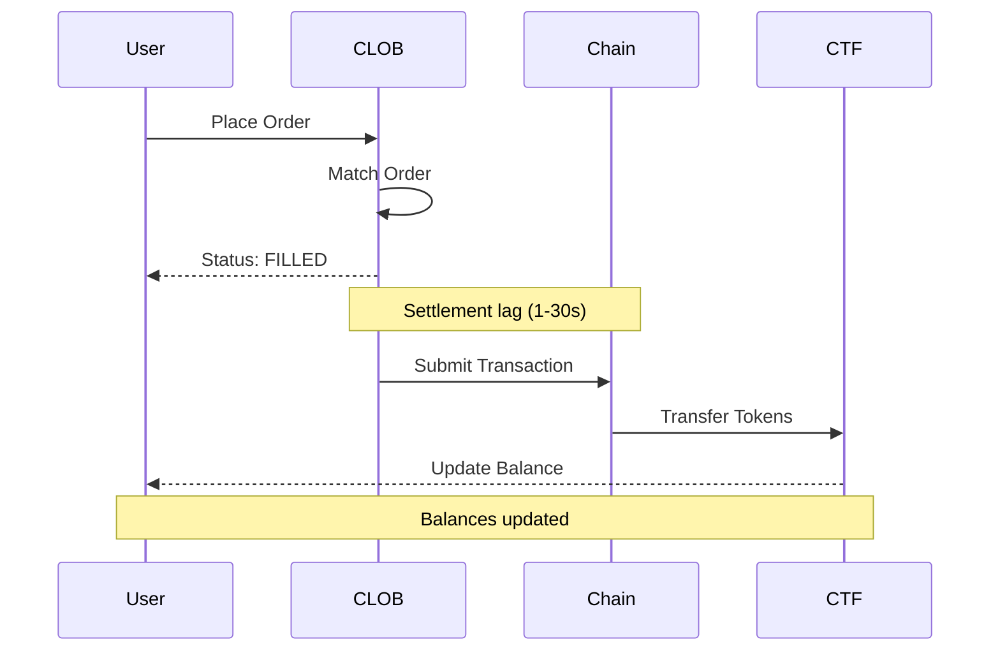

# Order Lifecycle - Complete Flow

This guide documents the complete order lifecycle in poly-sdk, from creation through settlement on-chain.

## Table of Contents

1. [State Machine Overview](#state-machine-overview)
2. [Lifecycle Stages](#lifecycle-stages)
3. [Status Mapping](#status-mapping)
4. [On-Chain Settlement](#on-chain-settlement)
5. [Edge Cases](#edge-cases)
6. [Code Examples](#code-examples)

---

## State Machine Overview

poly-sdk uses a 7-state internal enum for detailed order lifecycle tracking. Polymarket CLOB API returns 4 states which are mapped to these internal states.



### State Categories

**Active States** (can transition to other states):
- `pending` - Order created locally, not yet submitted
- `open` - Order in orderbook, awaiting fills
- `partially_filled` - Order partially filled, remaining in orderbook

**Terminal States** (final, no further transitions):
- `filled` - Order completely filled
- `cancelled` - Order cancelled by user/system
- `expired` - GTD order expired
- `rejected` - Order failed validation before submission

---

## Lifecycle Stages

### Stage 1: Order Creation (pending)

**Entry**: `createLimitOrder()` or `createBatchOrders()` called

**State**: `OrderStatus.PENDING`

**Actions**:
1. Validate order parameters
   - Minimum size: 5 shares
   - Minimum value: $1 USDC
   - Price within tick size
   - Valid expiration (for GTD orders)
2. Generate signed order locally
3. Store in local tracking (if implemented)

**Exit**: Submit to Polymarket CLOB API

**Transitions**:
- ✅ Submit successful → `OPEN`
- ❌ Validation failed → `REJECTED`

**Common Rejection Reasons**:
- Below minimum size/value
- Invalid price (not aligned to tick size)
- Insufficient balance
- API validation error
- Network error

---

### Stage 2: Order Active (open)

**Entry**: Order accepted by CLOB, added to orderbook

**State**: `OrderStatus.OPEN`

**Polymarket API Status**: `"live"`

**Actions**:
- Order visible in orderbook
- Waiting for counterparty matches
- Can be cancelled at any time

**Exit**: Fill received, expiration, or cancellation

**Transitions**:
- 📊 First fill → `PARTIALLY_FILLED`
- ✅ Full fill (rare for limit orders) → `FILLED`
- ❌ User cancel → `CANCELLED`
- ⏰ GTD expiry → `EXPIRED`

**Monitoring**:
```typescript
// Check if order can be cancelled
const canCancel = await sdk.trading.canCancelOrder(orderId);

// Get order details
const order = await sdk.trading.getOrder(orderId);
if (order && order.status === OrderStatus.OPEN) {
  console.log('Order is open, awaiting fills');
}
```

---

### Stage 3: Order Filling (partially_filled)

**Entry**: First fill received

**State**: `OrderStatus.PARTIALLY_FILLED`

**Polymarket API Status**: `"matched"` (with `size_matched < original_size`)

**Actions**:
- Some shares filled
- Remaining shares still in orderbook
- Can receive additional fills
- Can be cancelled (unfilled portion)

**Exit**: Fully filled, cancelled, or expired

**Transitions**:
- ✅ Remaining filled → `FILLED`
- ❌ User cancel → `CANCELLED` (keeps filled portion)
- ⏰ GTD expiry → `EXPIRED` (keeps filled portion)

**Monitoring**:
```typescript
// Get fill progress
const progress = await sdk.trading.getOrderProgress(orderId);
console.log(`Order ${progress?.toFixed(1)}% filled`);

// Get detailed order info
const order = await sdk.trading.getOrder(orderId);
if (order) {
  console.log(`Filled: ${order.filledSize}/${order.originalSize}`);
  console.log(`Remaining: ${order.remainingSize}`);
}
```

---

### Stage 4: Terminal States

#### 4.1 Filled (filled)

**Entry**: Order completely filled

**State**: `OrderStatus.FILLED`

**Polymarket API Status**: `"matched"` (with `size_matched === original_size`)

**Characteristics**:
- All shares executed
- No further state changes
- Settlement pending on-chain (see [On-Chain Settlement](#on-chain-settlement))
- Check `associateTrades` for trade IDs

**Example**:
```typescript
const order = await sdk.trading.getOrder(orderId);
if (order?.status === OrderStatus.FILLED) {
  console.log('Order fully filled');
  console.log(`Trade IDs: ${order.associateTrades.join(', ')}`);
  console.log(`Average price: ${order.price}`);
  console.log(`Total shares: ${order.filledSize}`);
}
```

#### 4.2 Cancelled (cancelled)

**Entry**: User or system cancellation

**State**: `OrderStatus.CANCELLED`

**Polymarket API Status**: `"cancelled"`

**Characteristics**:
- Order removed from orderbook
- Partial fills preserved (if any)
- Check `filledSize` for executed portion
- Check `remainingSize` for cancelled portion

**Example**:
```typescript
const result = await sdk.trading.cancelOrder(orderId);
if (result.success) {
  const order = await sdk.trading.getOrder(orderId);
  console.log(`Cancelled. Filled: ${order?.filledSize}, Cancelled: ${order?.remainingSize}`);
}
```

#### 4.3 Expired (expired)

**Entry**: GTD order expiration time reached

**State**: `OrderStatus.EXPIRED`

**Polymarket API Status**: `"expired"`

**Characteristics**:
- GTD orders only (GTC orders never expire)
- Partial fills preserved (if any)
- Automatically removed from orderbook at expiration

**Example**:
```typescript
// Create GTD order
const expiration = Math.floor(Date.now() / 1000) + 3600; // 1 hour
await sdk.trading.createLimitOrder({
  tokenId,
  side: 'BUY',
  price: 0.52,
  size: 100,
  orderType: 'GTD',
  expiration,
});
```

#### 4.4 Rejected (rejected)

**Entry**: Order failed validation before submission

**State**: `OrderStatus.REJECTED`

**Polymarket API Status**: N/A (never reaches API)

**Characteristics**:
- Local state only
- Never submitted to exchange
- No partial fills possible

**Common Causes**:
- Below minimum requirements
- Invalid parameters
- Pre-flight checks failed

---

## Status Mapping

### Polymarket API → Internal Status

| API Status | Condition | Internal Status |
|-----------|-----------|-----------------|
| `live` | `size_matched = 0` | `OPEN` |
| `live` | `size_matched > 0` | `PARTIALLY_FILLED` ⚠️ |
| `matched` | `size_matched < original_size` | `PARTIALLY_FILLED` |
| `matched` | `size_matched = original_size` | `FILLED` |
| `delayed` | - | `PENDING` |
| `cancelled` | - | `CANCELLED` |
| `expired` | - | `EXPIRED` |
| (local rejection) | - | `REJECTED` |

⚠️ **Edge Case**: `live` with `size_matched > 0` shouldn't happen per API docs, but SDK handles it as `PARTIALLY_FILLED`

### Helper Functions

```typescript
import {
  OrderStatus,
  isActiveStatus,
  isTerminalStatus,
  canOrderBeCancelled,
  isValidStatusTransition,
} from '@catalyst-team/poly-sdk';

// Check status category
if (isActiveStatus(order.status)) {
  console.log('Order can still change state');
}

if (isTerminalStatus(order.status)) {
  console.log('Order is final');
}

// Check cancellability
if (canOrderBeCancelled(order.status)) {
  await sdk.trading.cancelOrder(orderId);
}

// Validate state transition
const isValid = isValidStatusTransition(OrderStatus.OPEN, OrderStatus.FILLED);
console.log(`Transition valid: ${isValid}`);
```

---

## On-Chain Settlement

**Important**: Order status reflects **orderbook state**, not on-chain settlement.

### Settlement Flow



### Timeline

1. **Order Filled** (t=0s)
   - Status becomes `FILLED`
   - `associateTrades` populated with trade IDs
   - Orderbook state updated

2. **Settlement Pending** (t=0-30s)
   - Transaction submitted to Polygon
   - Tokens transfer on-chain
   - Balances not yet updated

3. **Settlement Complete** (t=~1-30s)
   - On-chain confirmation
   - Balances updated
   - Transaction hash available

### Checking Settlement

```typescript
// 1. Check order status
const order = await sdk.trading.getOrder(orderId);
if (order?.status === OrderStatus.FILLED) {
  console.log('Order filled on exchange');

  // 2. Get trade IDs
  const tradeIds = order.associateTrades;
  console.log(`Trades: ${tradeIds.join(', ')}`);

  // 3. Wait for on-chain settlement (~30s)
  await new Promise(resolve => setTimeout(resolve, 30000));

  // 4. Check balance
  const balance = await sdk.onchain.getPositionBalance(conditionId);
  console.log('Token balance:', balance);
}
```

---

## Edge Cases

### Case 1: Order Filled but Balance Unchanged

**Symptom**: `status === FILLED` but token balance is 0

**Cause**: Settlement lag (on-chain confirmation pending)

**Solution**:
```typescript
// Wait 30 seconds and check again
await new Promise(resolve => setTimeout(resolve, 30000));
const balance = await sdk.onchain.getPositionBalance(conditionId);

// Or check transaction hash from trades
const trades = await sdk.trading.getTrades(marketId);
const myTrade = trades.find(t => order.associateTrades.includes(t.id));
console.log('Transaction hash:', myTrade?.transactionHash);
```

---

### Case 2: "live" Order with size_matched > 0

**Symptom**: API returns `status: "live"` but `size_matched > 0`

**Cause**: API race condition or inconsistency

**SDK Handling**: Treats as `PARTIALLY_FILLED`

**Detection**:
```typescript
import { mapApiStatusToInternal } from '@catalyst-team/poly-sdk';

const apiOrder = await client.getOrder(orderId);
const internalStatus = mapApiStatusToInternal(apiOrder);

if (apiOrder.status === 'live' && apiOrder.size_matched > 0) {
  console.warn('API inconsistency detected');
  console.log('Internal status:', internalStatus); // PARTIALLY_FILLED
}
```

---

### Case 3: Cancelled Order with Partial Fills

**Symptom**: Order cancelled but has `filledSize > 0`

**Behavior**: This is normal and expected

**Details**:
- Status: `CANCELLED`
- Filled portion: Kept and settled on-chain
- Remaining portion: Cancelled and removed from orderbook

**Example**:
```typescript
// Order: Buy 100 shares @ 0.52
// Filled: 30 shares
// User cancels remaining 70 shares

const order = await sdk.trading.getOrder(orderId);
console.log(`Status: ${order.status}`);        // "cancelled"
console.log(`Filled: ${order.filledSize}`);    // 30
console.log(`Remaining: ${order.remainingSize}`); // 70 (cancelled)
```

---

### Case 4: Missing status Field in API Response

**Symptom**: API order object has no `status` field

**SDK Handling**: Defaults to `OPEN` with warning

**Detection**:
```typescript
// SDK logs warning to console
// [OrderStatus] Unknown API status: undefined, defaulting to OPEN
```

---

## Code Examples

### Example 1: Complete Order Flow

```typescript
import { PolymarketSDK, OrderStatus } from '@catalyst-team/poly-sdk';

const sdk = new PolymarketSDK({ privateKey: process.env.PRIVATE_KEY });
await sdk.start();

// Create order
const result = await sdk.trading.createLimitOrder({
  tokenId: '0x123...',
  side: 'BUY',
  price: 0.52,
  size: 100,
  orderType: 'GTC',
});

if (!result.success || !result.orderId) {
  console.error('Order rejected:', result.errorMsg);
  return;
}

// Monitor order status
const orderId = result.orderId;
let order = await sdk.trading.getOrder(orderId);

while (order && order.status === OrderStatus.OPEN) {
  console.log('Order is open, waiting for fills...');
  await new Promise(resolve => setTimeout(resolve, 5000));
  order = await sdk.trading.getOrder(orderId);
}

if (order?.status === OrderStatus.PARTIALLY_FILLED) {
  const progress = await sdk.trading.getOrderProgress(orderId);
  console.log(`Order ${progress}% filled`);

  // Cancel remaining
  if (await sdk.trading.canCancelOrder(orderId)) {
    await sdk.trading.cancelOrder(orderId);
  }
}

if (order?.status === OrderStatus.FILLED) {
  console.log('Order fully filled!');
  console.log(`Trades: ${order.associateTrades.join(', ')}`);

  // Wait for settlement
  await new Promise(resolve => setTimeout(resolve, 30000));
  console.log('Settlement complete');
}
```

---

### Example 2: Batch Order Status Tracking

```typescript
import { PolymarketSDK, OrderStatus, isTerminalStatus } from '@catalyst-team/poly-sdk';

const sdk = new PolymarketSDK({ privateKey: process.env.PRIVATE_KEY });
await sdk.start();

// Create batch orders
const orders = [
  { tokenId: '0x123...', side: 'BUY', price: 0.50, size: 50 },
  { tokenId: '0x456...', side: 'SELL', price: 0.60, size: 75 },
];

const result = await sdk.trading.createBatchOrders(orders);
if (!result.success || !result.orderIds) {
  console.error('Batch failed:', result.errorMsg);
  return;
}

// Track all orders
const orderIds = result.orderIds;
const checkInterval = setInterval(async () => {
  const statuses = await Promise.all(
    orderIds.map(id => sdk.trading.getOrder(id))
  );

  const summary = statuses.reduce((acc, order) => {
    if (order) acc[order.status]  = (acc[order.status] || 0) + 1;
    return acc;
  }, {} as Record<OrderStatus, number>);

  console.log('Order status summary:', summary);

  // Stop when all terminal
  if (statuses.every(o => o && isTerminalStatus(o.status))) {
    clearInterval(checkInterval);
    console.log('All orders completed');
  }
}, 5000);
```

---

### Example 3: GTD Order with Auto-Cancellation

```typescript
import { PolymarketSDK, OrderStatus } from '@catalyst-team/poly-sdk';

const sdk = new PolymarketSDK({ privateKey: process.env.PRIVATE_KEY });
await sdk.start();

// Create GTD order (expires in 1 hour)
const expiration = Math.floor(Date.now() / 1000) + 3600;
const result = await sdk.trading.createLimitOrder({
  tokenId: '0x123...',
  side: 'BUY',
  price: 0.48,
  size: 200,
  orderType: 'GTD',
  expiration,
});

if (!result.orderId) return;

// Monitor until expiration or fill
const orderId = result.orderId;
const checkInterval = setInterval(async () => {
  const order = await sdk.trading.getOrder(orderId);

  if (!order) {
    clearInterval(checkInterval);
    return;
  }

  if (order.status === OrderStatus.FILLED) {
    console.log('Order filled before expiration');
    clearInterval(checkInterval);
  }

  if (order.status === OrderStatus.EXPIRED) {
    console.log('Order expired');
    console.log(`Filled: ${order.filledSize}, Expired: ${order.remainingSize}`);
    clearInterval(checkInterval);
  }

  // Check time remaining
  if (order.expiration) {
    const remaining = order.expiration - Math.floor(Date.now() / 1000);
    console.log(`Time remaining: ${Math.floor(remaining / 60)} minutes`);
  }
}, 10000);
```

---

## Related Documentation

- [OrderStatus Enum](../../src/core/types.ts) - Complete state machine definition
- [Order Status Utilities](../../src/core/order-status.ts) - Helper functions
- [TradingService](../../src/services/trading-service.ts) - Order management methods
- [Polymarket Order Lifecycle](https://docs.polymarket.com/developers/CLOB/order-lifecycle) - Official API docs

---

## Summary

### Key Takeaways

1. **7 Internal States**: poly-sdk uses 7 states for detailed tracking, mapped from Polymarket's 4 API states

2. **Active vs Terminal**: Active states (`pending`, `open`, `partially_filled`) can transition; Terminal states are final

3. **Status ≠ Settlement**: `FILLED` status means matched on exchange, not necessarily settled on-chain (allow ~30s lag)

4. **Partial Fills**: Orders can be partially filled and then cancelled/expired - filled portion is preserved

5. **Helper Functions**: Use `canOrderBeCancelled()`, `isTerminalStatus()`, etc. instead of manual status checks

6. **Edge Cases**: SDK handles API inconsistencies gracefully with fallbacks and warnings

---

*Last Updated: 2026-01-14*
