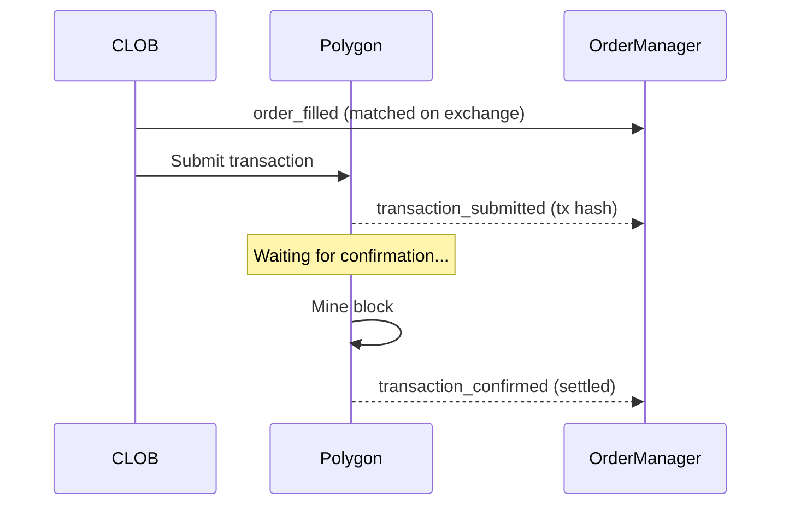

# OrderManager - Unified Order Creation & Lifecycle Monitoring

OrderManager provides a unified interface for creating orders and monitoring their complete lifecycle, from CLOB matching through on-chain settlement.

## Table of Contents

1. [Overview](#overview)
2. [Key Features](#key-features)
3. [Basic Usage](#basic-usage)
4. [Event System](#event-system)
5. [Auto-Watch Pattern](#auto-watch-pattern)
6. [Order Validation](#order-validation)
7. [Chain Settlement Tracking](#chain-settlement-tracking)
8. [Detection Modes](#detection-modes)
9. [Error Handling](#error-handling)
10. [Migration from FillDetector](#migration-from-filldetector)
11. [Advanced Usage](#advanced-usage)
12. [Best Practices](#best-practices)

---

## Overview

OrderManager combines order creation and lifecycle monitoring in a single, cohesive component. Unlike the deprecated FillDetector which only monitored fills, OrderManager tracks:

- **All order status changes** (pending → open → partially_filled → filled/cancelled/expired)
- **CLOB matching events** (orderbook fills)
- **Chain settlement** (transaction submission and on-chain confirmation)
- **Polymarket-specific validation** (tick size, minimum size, balance checks)

### Architecture

```
OrderManager (poly-sdk)
├─ createOrder() → auto-watch + auto-validate
├─ watchOrder() → manual watch (for external orders)
├─ cancelOrder()
├─ getOrder()
└─ Events (EventEmitter)
    ├─ order_created, order_opened
    ├─ order_partially_filled, order_filled
    ├─ transaction_submitted, transaction_confirmed  ← Chain settlement
    ├─ order_cancelled, order_expired, order_rejected
    └─ status_change (generic)
```

---

## Key Features

### 1. Unified Order Management

Create orders and automatically start monitoring - no manual `watchOrder()` needed:

```typescript
const result = await orderMgr.createOrder({
  tokenId: '0x...',
  side: 'BUY',
  price: 0.52,
  size: 100,
});

// Order is automatically watched! Events will be emitted.
```

### 2. Complete Lifecycle Tracking

Track orders from creation through on-chain settlement:

```
CLOB Events             Chain Events
─────────────           ────────────
order_created
order_opened
order_filled     ──→    transaction_submitted (tx hash available)
                 ──→    transaction_confirmed (on-chain settled)
```

### 3. Auto-Validation

All Polymarket-specific rules enforced before submission:

- **Tick size**: Price must be multiple of 0.01
- **Minimum size**: At least 5 shares
- **Minimum value**: At least $1 USDC
- **Balance check**: Sufficient USDC.e balance
- **Market status**: Market is active and not closed

### 4. Hybrid Detection

Reliable monitoring via WebSocket (fast) + REST polling (fallback):

- **WebSocket**: Real-time USER_ORDER and USER_TRADE events
- **Polling**: Backup for missed events or disconnections
- **Hybrid**: Best of both (recommended)

---

## Basic Usage

### Initialize OrderManager

```typescript
import { OrderManager } from '@catalyst-team/poly-sdk';

const orderMgr = new OrderManager({
  privateKey: process.env.PRIVATE_KEY,
  mode: 'hybrid',  // 'websocket' | 'polling' | 'hybrid'
  debug: false,
});

await orderMgr.start();
```

### Create an Order

```typescript
// Listen to events first
orderMgr.on('order_filled', (event) => {
  console.log(`Filled: ${event.fill.size} @ ${event.fill.price}`);
});

orderMgr.on('transaction_confirmed', (event) => {
  console.log(`On-chain confirmed: ${event.transactionHash}`);
});

// Create order (auto-watched)
const result = await orderMgr.createOrder({
  tokenId: '0x123...',
  side: 'BUY',
  price: 0.52,
  size: 100,
  orderType: 'GTC',
});

if (result.success && result.orderId) {
  console.log('Order created:', result.orderId);
  // Events will be emitted automatically
} else {
  console.error('Order failed:', result.errorMsg);
}
```

### Cancel an Order

```typescript
const result = await orderMgr.cancelOrder(orderId);

if (result.success) {
  console.log('Order cancelled');
} else {
  console.error('Cancellation failed:', result.errorMsg);
}
```

### Stop OrderManager

```typescript
orderMgr.stop();
```

---

## Event System

OrderManager extends `EventEmitter` and emits events for all lifecycle changes.

### Event Types

#### 1. `order_created`

Emitted when an order is created locally (before submission to CLOB).

```typescript
orderMgr.on('order_created', (order: Order) => {
  console.log('Order created:', order.id);
  console.log('Initial status:', order.status);  // OrderStatus.PENDING
});
```

#### 2. `status_change` (Generic)

Emitted for any status transition.

```typescript
orderMgr.on('status_change', (event: OrderStatusChangeEvent) => {
  console.log(`Order ${event.orderId}: ${event.from} → ${event.to}`);
  console.log('Reason:', event.reason);
  console.log('Full order:', event.order);
});
```

**Event Structure**:
```typescript
interface OrderStatusChangeEvent {
  orderId: string;
  from: OrderStatus;
  to: OrderStatus;
  order: Order;
  timestamp: number;
  reason?: string;
}
```

#### 3. `order_opened`

Emitted when order is accepted by CLOB and added to orderbook.

```typescript
orderMgr.on('order_opened', (order: Order) => {
  console.log('Order is now live in orderbook:', order.id);
});
```

#### 4. `order_partially_filled`

Emitted when order receives a partial fill.

```typescript
orderMgr.on('order_partially_filled', (event: FillEvent) => {
  console.log(`Partial fill: ${event.fill.size} @ ${event.fill.price}`);
  console.log(`Cumulative filled: ${event.cumulativeFilled}`);
  console.log(`Remaining: ${event.remainingSize}`);
});
```

**Event Structure**:
```typescript
interface FillEvent {
  orderId: string;
  order: Order;
  fill: {
    tradeId: string;
    size: number;
    price: number;
    fee: number;
    timestamp: number;
    transactionHash?: string;
  };
  cumulativeFilled: number;
  remainingSize: number;
  isCompleteFill: boolean;
}
```

#### 5. `order_filled`

Emitted when order is completely filled.

```typescript
orderMgr.on('order_filled', (event: FillEvent) => {
  console.log(`Order fully filled: ${event.orderId}`);
  console.log(`Total size: ${event.cumulativeFilled}`);
  console.log(`Average price: ${event.order.price}`);
  console.log(`Trade IDs: ${event.order.associateTrades.join(', ')}`);
});
```

#### 6. `transaction_submitted` 🆕

Emitted when transaction hash becomes available (after CLOB match).

```typescript
orderMgr.on('transaction_submitted', (event: TransactionEvent) => {
  console.log('Transaction submitted:', event.transactionHash);
  console.log('Order:', event.orderId);
  console.log('Trade:', event.tradeId);
});
```

**Event Structure**:
```typescript
interface TransactionEvent {
  orderId: string;
  tradeId: string;
  transactionHash: string;
  timestamp: number;
}
```

#### 7. `transaction_confirmed` 🆕

Emitted when transaction is confirmed on-chain (Polygon).

```typescript
orderMgr.on('transaction_confirmed', (event: SettlementEvent) => {
  console.log('On-chain confirmed:', event.transactionHash);
  console.log('Block:', event.blockNumber);
  console.log('Gas used:', event.gasUsed);
});
```

**Event Structure**:
```typescript
interface SettlementEvent {
  orderId: string;
  tradeId: string;
  transactionHash: string;
  blockNumber: number;
  gasUsed: string;
  timestamp: number;
}
```

**Timeline**:
```
t=0s      order_filled (CLOB match)
t=0-5s    transaction_submitted (tx hash available)
t=1-30s   transaction_confirmed (on-chain settled)
```

#### 8. `order_cancelled`

Emitted when order is cancelled.

```typescript
orderMgr.on('order_cancelled', (event: CancelEvent) => {
  console.log('Order cancelled:', event.orderId);
  console.log('Filled before cancel:', event.order.filledSize);
  console.log('Cancelled amount:', event.order.remainingSize);
});
```

#### 9. `order_expired`

Emitted when GTD order expires.

```typescript
orderMgr.on('order_expired', (event: ExpireEvent) => {
  console.log('Order expired:', event.orderId);
  console.log('Expiration time:', new Date(event.order.expiration! * 1000));
});
```

#### 10. `order_rejected`

Emitted when order fails validation before submission.

```typescript
orderMgr.on('order_rejected', (event: RejectEvent) => {
  console.error('Order rejected:', event.orderId);
  console.error('Reason:', event.reason);
});
```

#### 11. `error`

Emitted for errors during monitoring.

```typescript
orderMgr.on('error', (error: Error) => {
  console.error('OrderManager error:', error.message);
});
```

---

## Auto-Watch Pattern

One of OrderManager's key features is **automatic order watching**. When you create an order, OrderManager automatically:

1. Submits order to CLOB
2. Adds order to watched list
3. Starts monitoring via WebSocket/polling
4. Emits events for all status changes
5. Auto-unwatches when order reaches terminal state

### Create & Auto-Watch

```typescript
const result = await orderMgr.createOrder({
  tokenId: '0x...',
  side: 'BUY',
  price: 0.52,
  size: 100,
});

// Order is now being watched automatically!
// No need to call watchOrder()
```

### Check Watched Orders

```typescript
const watchedOrders = orderMgr.getWatchedOrders();
console.log(`Watching ${watchedOrders.length} orders`);

for (const order of watchedOrders) {
  console.log(`- ${order.id}: ${order.status}`);
}
```

### Manual Watch (External Orders)

For orders created outside of OrderManager:

```typescript
// Watch an existing order by ID
orderMgr.watchOrder(orderId, {
  strategyId: 'my-strategy',
  notes: 'External order from another system',
});
```

### Manual Unwatch

```typescript
// Stop watching an order (before terminal state)
orderMgr.unwatchOrder(orderId);
```

**Auto-Unwatch**: Orders in terminal states (filled, cancelled, expired, rejected) are automatically unwatched to prevent memory leaks.

---

## Order Validation

OrderManager enforces all Polymarket-specific rules before submitting orders to CLOB.

### Validation Rules

#### 1. Tick Size (0.01)

Prices must be multiples of 0.01:

```typescript
// ✓ Valid
await orderMgr.createOrder({ price: 0.52, ... });  // OK
await orderMgr.createOrder({ price: 0.10, ... });  // OK

// ✗ Invalid
await orderMgr.createOrder({ price: 0.503, ... });  // Error: INVALID_TICK_SIZE
await orderMgr.createOrder({ price: 0.5234, ... }); // Error: INVALID_TICK_SIZE
```

#### 2. Minimum Size (5 shares)

Orders must have at least 5 shares:

```typescript
// ✓ Valid
await orderMgr.createOrder({ size: 5, ... });    // OK
await orderMgr.createOrder({ size: 100, ... });  // OK

// ✗ Invalid
await orderMgr.createOrder({ size: 3, ... });    // Error: BELOW_MINIMUM_SIZE
await orderMgr.createOrder({ size: 1, ... });    // Error: BELOW_MINIMUM_SIZE
```

#### 3. Minimum Value ($1 USDC)

Order value (size × price) must be at least $1:

```typescript
// ✓ Valid
await orderMgr.createOrder({ size: 10, price: 0.10, ... });  // $1.00 OK
await orderMgr.createOrder({ size: 100, price: 0.50, ... }); // $50.00 OK

// ✗ Invalid
await orderMgr.createOrder({ size: 5, price: 0.10, ... });   // $0.50 Error: BELOW_MINIMUM_VALUE
```

#### 4. Price Range (0.001 - 0.999)

Prices must be within valid range:

```typescript
// ✓ Valid
await orderMgr.createOrder({ price: 0.01, ... });  // OK
await orderMgr.createOrder({ price: 0.99, ... });  // OK

// ✗ Invalid
await orderMgr.createOrder({ price: 0.999, ... }); // Error: INVALID_PRICE_RANGE
await orderMgr.createOrder({ price: 1.00, ... });  // Error: INVALID_PRICE_RANGE
```

### Validation Errors

When validation fails, `createOrder()` returns an error result:

```typescript
const result = await orderMgr.createOrder({
  tokenId: '0x...',
  side: 'BUY',
  price: 0.503,  // Invalid tick size
  size: 100,
});

if (!result.success) {
  console.error('Validation failed:', result.errorMsg);
  // Error: "INVALID_TICK_SIZE: Price must be a multiple of 0.01"
}
```

**Error Codes**:
- `INVALID_TICK_SIZE`: Price not a multiple of 0.01
- `BELOW_MINIMUM_SIZE`: Size < 5 shares
- `BELOW_MINIMUM_VALUE`: Value < $1 USDC
- `INVALID_PRICE_RANGE`: Price outside [0.001, 0.999]
- `MARKET_NOT_TRADEABLE`: Market is closed or inactive
- `INSUFFICIENT_BALANCE`: Not enough USDC.e

---

## Chain Settlement Tracking

OrderManager tracks the complete settlement flow from CLOB matching through on-chain confirmation.

### Settlement Flow



### Tracking Settlement

```typescript
// Listen to both CLOB and chain events
orderMgr.on('order_filled', (event) => {
  console.log(`[CLOB] Order filled: ${event.fill.size} @ ${event.fill.price}`);
  console.log(`[CLOB] Trade ID: ${event.fill.tradeId}`);
});

orderMgr.on('transaction_submitted', (event) => {
  console.log(`[Chain] Transaction submitted: ${event.transactionHash}`);
  console.log(`[Chain] You can track at: https://polygonscan.com/tx/${event.transactionHash}`);
});

orderMgr.on('transaction_confirmed', (event) => {
  console.log(`[Chain] Transaction confirmed in block ${event.blockNumber}`);
  console.log(`[Chain] Gas used: ${event.gasUsed}`);
  console.log(`[Chain] Settlement complete - tokens are now in your wallet!`);
});
```

### Settlement Timeline

| Event | Timing | Meaning |
|-------|--------|---------|
| `order_filled` | t=0s | Order matched on CLOB |
| `transaction_submitted` | t=0-5s | Transaction hash available |
| `transaction_confirmed` | t=1-30s | On-chain confirmation |

**Important**: `order_filled` means matched on exchange, NOT necessarily settled on-chain. Wait for `transaction_confirmed` to ensure tokens are in your wallet.

### Checking Token Balance

After `transaction_confirmed`, verify token balance:

```typescript
orderMgr.on('transaction_confirmed', async (event) => {
  console.log('Settlement confirmed!');

  // Wait a bit more for balance to update
  await new Promise(resolve => setTimeout(resolve, 5000));

  // Check balance via SDK
  const balance = await sdk.onchain.getPositionBalance(conditionId);
  console.log('Token balance:', balance);
});
```

---

## Detection Modes

OrderManager supports three detection modes for monitoring order status.

### 1. WebSocket Mode (Fast, Real-time)

Uses Polymarket RealtimeServiceV2 for low-latency event detection.

```typescript
const orderMgr = new OrderManager({
  privateKey: '0x...',
  mode: 'websocket',
});
```

**Pros**:
- Real-time updates (< 100ms latency)
- No polling overhead
- Battery-efficient

**Cons**:
- Can miss events if connection drops
- Requires WebSocket connection

**Use when**:
- Running on stable connection
- Need real-time updates
- Short-lived orders

### 2. Polling Mode (Reliable, Backup)

Polls TradingService at regular intervals.

```typescript
const orderMgr = new OrderManager({
  privateKey: '0x...',
  mode: 'polling',
  pollInterval: 5000,  // Poll every 5 seconds
});
```

**Pros**:
- Guaranteed to catch all status changes
- No WebSocket dependency
- Works with restrictive networks

**Cons**:
- Higher latency (default: 5 seconds)
- More API calls
- Polling overhead

**Use when**:
- WebSocket not available
- Running in restrictive environments
- Need guaranteed detection

### 3. Hybrid Mode (Recommended)

Combines WebSocket (primary) + polling (fallback).

```typescript
const orderMgr = new OrderManager({
  privateKey: '0x...',
  mode: 'hybrid',  // Default
  pollInterval: 5000,  // Fallback polling
  pollFallbackDelay: 30000,  // Start polling after 30s if no WS events
});
```

**Pros**:
- Best of both worlds
- Real-time updates via WebSocket
- Polling backup for missed events
- Automatically switches on disconnect

**Cons**:
- Slightly more complex
- More connections/API calls

**Use when**:
- Production environments
- Critical orders
- Need reliability + speed

---

## Error Handling

OrderManager provides comprehensive error handling at every stage.

### Order Creation Errors

```typescript
const result = await orderMgr.createOrder({
  tokenId: '0x...',
  side: 'BUY',
  price: 0.52,
  size: 100,
});

if (!result.success) {
  console.error('Order creation failed:', result.errorMsg);

  // Error categories:
  // - Validation errors (tick size, minimum size, etc.)
  // - Balance errors (insufficient USDC.e)
  // - Network errors (CLOB API unavailable)
  // - Market errors (market closed, inactive)
}
```

### Monitoring Errors

```typescript
orderMgr.on('error', (error: Error) => {
  console.error('Monitoring error:', error.message);

  // Common causes:
  // - WebSocket disconnection
  // - Rate limit exceeded
  // - Network timeout
  // - Invalid order ID
});
```

### Cancellation Errors

```typescript
const result = await orderMgr.cancelOrder(orderId);

if (!result.success) {
  console.error('Cancellation failed:', result.errorMsg);

  // Common reasons:
  // - Order already filled/cancelled
  // - Order doesn't exist
  // - Network error
  // - Not owner of order
}
```

### Error Recovery

```typescript
orderMgr.on('error', async (error) => {
  console.error('Error:', error.message);

  // Auto-retry logic
  if (error.message.includes('WebSocket')) {
    console.log('WebSocket error, falling back to polling...');
    // Hybrid mode will automatically switch to polling
  }

  if (error.message.includes('Rate limit')) {
    console.log('Rate limit hit, backing off...');
    await new Promise(resolve => setTimeout(resolve, 60000));
  }
});
```

---

## Migration from FillDetector

If you're currently using the deprecated `FillDetector`, here's how to migrate to `OrderManager`.

### Before (FillDetector)

```typescript
import { FillDetector } from '@catalyst-team/earning-engine/infrastructure';

const detector = new FillDetector({
  privateKey: '0x...',
  market: {
    conditionId: '0x...',
    yesTokenId: '0x...',
    noTokenId: '0x...',
  },
  mode: 'hybrid',
});

detector.on('fill', (fill) => {
  console.log('Filled:', fill);
});

await detector.start();

// Create order via TradingService
const result = await tradingService.createLimitOrder({ ... });

// Manually watch order
if (result.orderId) {
  detector.watchOrder(result.orderId, tokenId, 'BUY', price, size);
}
```

### After (OrderManager)

```typescript
import { OrderManager } from '@catalyst-team/poly-sdk';

const orderMgr = new OrderManager({
  privateKey: '0x...',
  mode: 'hybrid',
});

// More comprehensive events
orderMgr.on('order_filled', (event) => {
  console.log('Filled:', event.fill);
  console.log('Full order:', event.order);
});

orderMgr.on('order_partially_filled', (event) => {
  console.log('Partial fill:', event.fill);
  console.log('Remaining:', event.remainingSize);
});

orderMgr.on('transaction_confirmed', (event) => {
  console.log('On-chain confirmed:', event.transactionHash);
});

await orderMgr.start();

// Create order (auto-watches!)
const result = await orderMgr.createOrder({
  tokenId: '0x...',
  side: 'BUY',
  price: 0.52,
  size: 100,
});

// No manual watchOrder needed!
```

### Migration Checklist

- [ ] Replace `FillDetector` import with `OrderManager`
- [ ] Remove `market` config (only need `privateKey`)
- [ ] Update event listeners:
  - `fill` → `order_filled` or `order_partially_filled`
- [ ] Replace manual `watchOrder` with `createOrder` (auto-watch)
- [ ] Add new event listeners (optional):
  - `transaction_submitted`
  - `transaction_confirmed`
  - `order_opened`
  - `order_cancelled`
  - `order_expired`
- [ ] Remove `conditionId`/`yesTokenId`/`noTokenId` from config
- [ ] Test with small orders first

---

## Advanced Usage

### Custom Metadata

Attach custom metadata to orders for tracking:

```typescript
const result = await orderMgr.createOrder(
  {
    tokenId: '0x...',
    side: 'BUY',
    price: 0.52,
    size: 100,
  },
  {
    strategyId: 'dip-arb-v2',
    sessionId: 'session-123',
    notes: 'Entry signal: RSI < 30',
  }
);

// Access metadata later
orderMgr.on('order_filled', (event) => {
  const order = event.order;
  console.log('Strategy:', order.metadata?.strategyId);
  console.log('Notes:', order.metadata?.notes);
});
```

### Batch Order Creation

Create multiple orders at once:

```typescript
const result = await orderMgr.createBatchOrders([
  {
    tokenId: primaryTokenId,
    side: 'BUY',
    price: 0.48,
    size: 50,
  },
  {
    tokenId: secondaryTokenId,
    side: 'SELL',
    price: 0.52,
    size: 50,
  },
]);

if (result.success && result.orderIds) {
  console.log('Batch orders created:', result.orderIds);
  // All orders are auto-watched!
}
```

### GTD Orders (Good-Til-Date)

Create orders that expire after a specific time:

```typescript
const expiration = Math.floor(Date.now() / 1000) + 3600; // Expires in 1 hour

const result = await orderMgr.createOrder({
  tokenId: '0x...',
  side: 'BUY',
  price: 0.50,
  size: 100,
  orderType: 'GTD',
  expiration,
});

orderMgr.on('order_expired', (event) => {
  console.log('Order expired at:', new Date(event.order.expiration! * 1000));
  console.log('Filled before expiration:', event.order.filledSize);
});
```

### Order Progress Tracking

Monitor order fill progress:

```typescript
orderMgr.on('order_partially_filled', async (event) => {
  const progress = (event.cumulativeFilled / event.order.originalSize) * 100;
  console.log(`Order ${progress.toFixed(1)}% filled`);

  // Get latest order state
  const order = await orderMgr.getOrder(event.orderId);
  if (order) {
    console.log(`Current: ${order.filledSize}/${order.originalSize}`);
  }
});
```

### Watch External Orders

Monitor orders created outside of OrderManager:

```typescript
// Watch an existing order by ID
orderMgr.watchOrder('0xorder123...', {
  strategyId: 'external-strategy',
  notes: 'Order created via CLOB API directly',
});

// Events will be emitted for this order
orderMgr.on('order_filled', (event) => {
  if (event.orderId === '0xorder123...') {
    console.log('External order filled!');
  }
});
```

---

## Best Practices

### 1. Always Listen to Events Before Creating Orders

```typescript
// ✓ Good: Setup listeners first
orderMgr.on('order_filled', (event) => { ... });
orderMgr.on('order_cancelled', (event) => { ... });

await orderMgr.createOrder({ ... });

// ✗ Bad: Create order first, miss early events
await orderMgr.createOrder({ ... });
orderMgr.on('order_filled', (event) => { ... });  // May miss events!
```

### 2. Handle All Event Types

```typescript
// Listen to all relevant events
orderMgr.on('order_opened', ...);
orderMgr.on('order_partially_filled', ...);
orderMgr.on('order_filled', ...);
orderMgr.on('order_cancelled', ...);
orderMgr.on('order_expired', ...);
orderMgr.on('error', ...);
```

### 3. Use Hybrid Mode in Production

```typescript
// Recommended for production
const orderMgr = new OrderManager({
  privateKey: process.env.PRIVATE_KEY,
  mode: 'hybrid',  // Best reliability + speed
});
```

### 4. Check Result Success

```typescript
const result = await orderMgr.createOrder({ ... });

if (!result.success) {
  console.error('Order failed:', result.errorMsg);
  // Handle error (retry, alert, etc.)
  return;
}

console.log('Order created:', result.orderId);
```

### 5. Track Settlement for Important Orders

```typescript
// For critical orders, wait for on-chain confirmation
orderMgr.on('transaction_confirmed', async (event) => {
  console.log('Settlement confirmed:', event.transactionHash);

  // Now safe to rely on token balance
  const balance = await sdk.onchain.getPositionBalance(conditionId);
  console.log('Updated balance:', balance);
});
```

### 6. Clean Up on Stop

```typescript
// Properly stop OrderManager when done
process.on('SIGINT', () => {
  console.log('Shutting down...');
  orderMgr.stop();
  process.exit(0);
});
```

### 7. Use Metadata for Tracking

```typescript
// Attach context to orders
await orderMgr.createOrder(
  { ... },
  {
    strategyId: 'my-strategy',
    sessionId: sessionId,
    notes: `Entry: ${entryReason}`,
  }
);

// Retrieve context later
orderMgr.on('order_filled', (event) => {
  log(`Strategy ${event.order.metadata?.strategyId} filled`);
});
```

### 8. Handle Partial Fills Appropriately

```typescript
orderMgr.on('order_partially_filled', async (event) => {
  const progress = event.cumulativeFilled / event.order.originalSize;

  // Decide whether to cancel remaining
  if (progress >= 0.8) {  // 80% filled
    console.log('Good enough, cancelling remaining');
    await orderMgr.cancelOrder(event.orderId);
  }
});
```

### 9. Monitor Error Events

```typescript
orderMgr.on('error', (error) => {
  console.error('OrderManager error:', error.message);

  // Log for debugging
  logger.error('OrderManager error', {
    message: error.message,
    stack: error.stack,
  });

  // Alert if critical
  if (error.message.includes('CRITICAL')) {
    alerting.send('OrderManager critical error');
  }
});
```

### 10. Test Validation Before Deploying

```typescript
// Test validation with small orders
try {
  await orderMgr.createOrder({
    tokenId: '0x...',
    side: 'BUY',
    price: 0.503,  // Will fail: invalid tick size
    size: 10,
  });
} catch (error) {
  console.log('Validation working correctly:', error.message);
}
```

---

## Related Documentation

- [Order Lifecycle Guide](./order-lifecycle.md) - Complete order status state machine
- [Order Status Utilities](../../src/core/order-status.ts) - Helper functions for status checks
- [TradingService API](../../src/services/trading-service.ts) - Low-level order operations
- [Polymarket CLOB Docs](https://docs.polymarket.com/developers/CLOB) - Official API documentation

---

*Last Updated: 2026-01-14*
